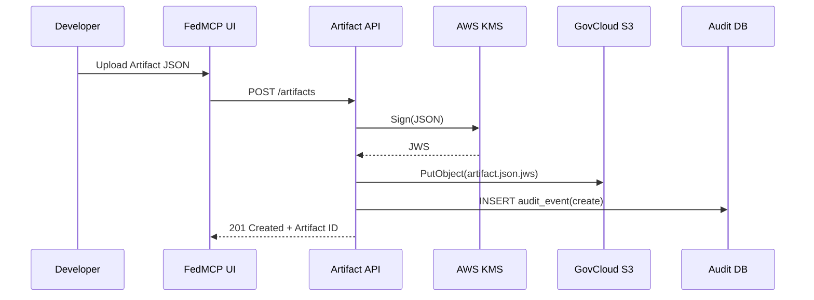

# FedMCP Specification v0.2 (DRAFT)

> **Status** | Working Draft — internal review only\
> **Editors** | Lance Kallman, FedMCP Team\
> **Version** | v0.2\
> **Last updated** | 2025‑06‑16

---

## Revision History

| Version     | Date  | Author | Notes             |
| ----------- | ----- | ------ | ----------------- |
|  0.2‑draft  |  TBD  |  LK    | Initial scaffold  |

---

## Table of Contents

1. [Introduction](#1-introduction)
2. [Glossary](#2-glossary)
3. [Artifact Model](#3-artifact-model)\
     3.1 [JSON Schema](#31-json-schema)
4. [JWS Signing Profile](#4-jws-signing-profile)
5. [Audit Event Model](#5-audit-event-model)
6. [Security Considerations](#6-security-considerations)
7. [Open Issues](#7-open-issues)
8. [Appendix A — Sequence Diagram](#appendix-a-—-sequence-diagram)

---

## 1 Introduction

FedMCP (Federal **M**odel **C**ontext **P**rotocol) defines a signed, auditable data‑exchange format and operational workflow for deploying large‑language‑model (LLM) agents and related compliance artifacts into **FedRAMP Moderate/High** and **DoD IL 4/5** environments.

This document specifies:

- The canonical **Artifact** JSON structure.
- Mandatory **JWS** signing & verification rules.
- A normalized **Audit Event** schema for traceability.

## 2 Glossary

| Term              | Definition                                                                                          |
| ----------------- | --------------------------------------------------------------------------------------------------- |
| **Artifact**      | Any JSON‐serializable compliance or ML object (e.g., SSP fragment, Agent Recipe) managed by FedMCP. |
| **JWS**           | JSON Web Signature (RFC 7515) used to create tamper‑evident envelopes around Artifacts.             |
| **Issuer (iss)**  | The workspace UUID that generated the JWS.                                                          |
| **Subject (sub)** | The Artifact `id` being signed.                                                                     |
| **Audit Event**   | Immutable log entry captured on every state change (create, update, deploy).                        |

## 3 Artifact Model

Each Artifact is a top‑level JSON object with **required** fields:

| Field           | Type                 | Description                                      |
| --------------- | -------------------- | ------------------------------------------------ |
|  `id`           |  UUID                | Globally unique artifact identifier.             |
|  `type`         |  string              | Category (e.g., `ssp_fragment`, `agent_recipe`). |
|  `version`      |  int                 | Monotonically increasing semantic version.       |
|  `workspaceId`  |  UUID                | Tenant scope for multitenancy isolation.         |
|  `createdAt`    |  RFC 3339 timestamp  | Creation time (UTC).                             |
|  `jsonBody`     |  object              | Arbitrary schema defined per `type`.             |

\
**Artifact Type Enumeration**

| Type              | Description                               |
| ----------------- | ----------------------------------------- |
| `ssp_fragment`    | NIST 800‑53 System Security Plan fragment |
| `poam_template`   | Plan of Action & Milestones template      |
| `agent_recipe`    | LLM agent orchestration definition        |
| `baseline_module` | Infrastructure baseline (Terraform/CDK)   |
| `audit_script`    | Automated verification script             |

\### 3.1 JSON Schema\
The authoritative JSON Schema is published at [https://mcpfedspec.org/artifact.schema.json](https://mcpfedspec.org/artifact.schema.json).

```jsonc
{
  "$schema": "https://json-schema.org/draft/2020-12/schema",
  "$id": "https://mcpfedspec.org/artifact.schema.json",
  "title": "FedMCP Artifact",
  "type": "object",
  "required": ["id", "type", "version", "workspaceId", "createdAt", "jsonBody"],
  "properties": {
    "id": { "type": "string", "format": "uuid" },
    "type": { "type": "string" },
    "version": { "type": "integer", "minimum": 1 },
    "workspaceId": { "type": "string", "format": "uuid" },
    "createdAt": { "type": "string", "format": "date-time" },
    "jsonBody": { "type": "object" }
  }
}
```

## 4 JWS Signing Profile

1. **Header claims** (all required):\
     `alg=ES256`  `typ=JWT`  `kid=<key‑fingerprint>`
2. **Payload** is the raw Artifact JSON (not base64) canonicalized with RFC 8785.
3. **Signature** uses NIST P‑256 private key stored in AWS KMS **per workspace**.
4. **Public‑key distribution** via JWKS endpoint `/jwks/<workspaceId>`.
5. **Verification** must reject if:   \* `alg` ≠ `ES256`   \* `iss` ≠ caller’s workspace UUID   \* `exp` < now (optional future field)

## 5 Audit Event Model

| Field          | Type       | Notes                                       |
| -------------- | ---------- | ------------------------------------------- |
|  `eventId`     |  UUID      | Primary key.                                |
|  `artifactId`  |  UUID      | Target Artifact.                            |
|  `action`      |  enum      | `create` `update` `deploy` `delete`.        |
|  `actor`       |  string    | `user:<sub>` or `service:<lambda>`          |
|  `timestamp`   |  RFC 3339  | When the event occurred.                    |
|  `jws`         |  string    | Signature of the event row (optional v0.2). |

Events are written to `audit_events` table (Postgres) **and** streamed to CloudTrail.

## 6 Security Considerations

- All TLS endpoints must enforce TLS 1.2+ FIPS ciphers.
- JWS keys rotate every 180 days; overlap grace period 30 days.
- Artifact `jsonBody` size capped at **1 MiB** to mitigate DoS.

## 7 Open Issues

1. Should we support detached JWS?
2. Decide on multi‑sig support for artifacts with joint authorship.

## Appendix A — Sequence Diagram



---

> **End of Spec v0.2 (Draft)**

